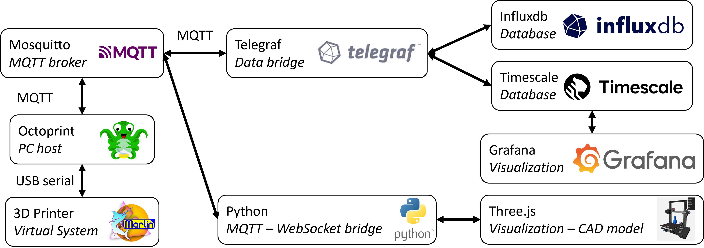

# 3d-printer-digital-twin

Repository containing a 3d printer digital twin (shadow) setup to be used at the 2nd Next-gen DT Engineering workshop

the main components are shown below.

## Testing

Have been tested and working: octoprint, mosquitto, grafana (with little configuration of dashboard)

TODO

- try the klipper virtual printer with moonraker/mainsail. Also checkout the mqtt config of moonraker.
- try the klipper virtual printer with octoprint

## configurability:

Note: not yet implemented, part of todo

The docker compose file uses profiles to make services configurable:

* virtual printer: swap between octoprint's virtual printer and a klipper virtual printer with option `--profile octoprint-marlin` or `--profile octoprint-klipper`
* klipper API server (only for when using simulated klipper printer): swap between octoprint with virtual klipper printer and Moonraker/Mainsail with option `--profile octoprint-klipper` or `--profile mainsail-klipper`

Mosquitto + Octoprint Marlin:

        docker compose --profile mosquitto --profile octoprint-marlin up -d

Mosquitto + Octoprint Klipper:

        docker compose --profile mosquitto --profile octoprint-klipper up -d

Mosquitto + Mainsail Klipper:

## Notes on the octoprint config

The octoprint instance comes preconfigured, but for reference this section contains some notes on the config.

## notes about root user:

https://forums.docker.com/t/bind-mount-with-current-users-ownership/147176/3

Unless directories used for bind mounts already exist, docker creates them with the root user. Some containers need you to specify user: "0" to be able to write to the directories. The clean approach would be to chmod the directories after creation, but just running as root user is faster.

## Notes on the Zenoh MQTT broker:

Doesn't support QoS 2 - doesn't break our demo luckily
Doesn't support Last Will & Status -> in Octoprint, must disable this (two checkmarks in MQTT config), otherwise client will keep disconnecting.

## Moonraker/mainsail printer simulation

we'll use this fork of the virtual klipper printer, which fixes a timing issue by replacing the avr simulator.

https://github.com/mspi92/virtual-klipper-printer/tree/issue-43-host

You'll have to clone this repository first, and build the 

        git clone https://github.com/mspi92/virtual-klipper-printer.git
        git checkout issue-43-host

I've noticed a bug with the temperature, so before building, in `example-configs/addons/single_extruder.cfg` set the `min_extrude_temp` to 0

The image can then be built:

        docker compose -f docker-compose.build.yml -f docker-compose.yml build

And we use this image in our docker compose file.

TODO: add the MQTT configuration to the example config?

Okay, MQTT config works, but then I'd either need to intercept and republish (might be easiest), or update Grafana
Probably republishing is the easiest.

### using klipper with octoprint

https://www.klipper3d.org/OctoPrint.html

So I'll have to rebuild an image for that where I toss out moonraker and replace it with octoprint.

Is that something feasible > it is, see my fork (todo: push this to github), but problem is that the position isn't updated on the MQTT server, even with M154 enabled.
I think M154 is a specific Marlin thing, and am for now unsure how to get octoprint-klipper to spit out the position updates.

### mqtt configuration

https://moonraker.readthedocs.io/en/latest/configuration/#mqtt