# 3d-printer-digital-twin

Repository containing a 3d printer digital twin (shadow) setup to be used at the 2nd Next-gen DT Engineering workshop

the main components are shown below (TODO: update image concerning reconfigurability)

## Configurability

The setup has been built around a configurable docker compose file using profiles.
As such, we can swap components out.

* For the virtual 3D printer + frontend, you can choose between Octoprint+Marlin, Mainsail+Moonraker+Klipper and Octoprint+Klipper.
* The message broker can be swapped out between Eclipse Mosquitto and Zenoh.

you specify which components you need with the `--profile` option of docker compose and one of the following arguments for the virtual printer:

* `octoprint-marlin`
* `mainsail-klipper`
* `octoprint-klipper` - note: don't use, doesn't send positionUpdates so no position data is logged.

and one of the following arguments for the broker

* `mosquitto`
* `zenoh`

Both arguments need to be specified.

Docker compose examples:

Mosquitto + Octoprint Marlin:

        docker compose --profile mosquitto --profile octoprint-marlin up -d --build

Zenoh + Octoprint Klipper:

        docker compose --profile zenoh --profile octoprint-klipper up -d --build

Mosquitto + Mainsail Klipper:

        docker compose --profile mosquitto --profile mainsail-klipper up -d --build

The build option is needed because the `mqtt-websocket-bridge` application is built on the go.
Note: if you make changes to that application, you have to rebuild the image. `--build` seems to use cache which sometimes doesn't seem to incorporate the changes to the file (I think there's some way to specify, not quite sure). Anyway, you can rebuild with `docker compose --profile mosquitto --profile mainsail-klipper build`, then spin up with `docker compose --profile mosquitto --profile mainsail-klipper up -d --build`.

Similarly, to bring the containers back down, replace `up -d` with `down`

## Useful web addresses:

General:

* Grafana: http://localhost:3000
* 3D printer visualization: http://localhost:8000
* MQTT broker: mqtt://localhost:1883 on your local compupter or mqtt://broker:1883 on the docker containers.

Profile `octoprint-marlin`

* Octoprint: http://localhost:80

Profile `octoprint-klipper`

* Octoprint: http://localhost:5000

Profile `mainsail-klipper`

* Moonraker: http://localhost:7125
* Mainsail: http://localhost:80

Note: when switching between profiles, 

## First time setup

Some first time setup is needed:
* Some of the Docker images still need to be built.
* The OctoPrint configuration and the Grafana configuration are not stored on git, and must be configured manually.

### Building Docker Images

The `octoprint-marlin` profile and the broker profiles work out of the box. For the two profiles with klipper, you first need to build the docker image.

I have forked the repository to make this easier, the commands to build them are:

        git clone https://github.com/joostm8/virtual-klipper-printer.git
        cd virtual-klipper-printer
        git checkout issue-43-host
        docker compose -f docker-compose.build.yml -f docker-compose.yml build
        git checkout moonrake-to-octoprint
        docker compose -f docker-compose.build.yml -f docker-compose.yml build

The `issue-43-host` branch builds the `mainsail-klipper` image

The `moonrake-to-octoprint` branch builds the `octoprint-klipper` image (yes there's a typo in the branch name)

After building the images are available locally and you can spin them up with the provided compose file.

### Setting up OctoPrint+Marlin

#### Initial setup

Follow the initial setup wizard. In the `restart octoprint command`, add `s6-svc -r /var/run/s6/services/octoprint`

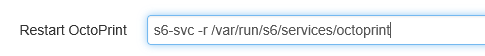

#### Adding a Virtual Printer

Click the settings wrench.

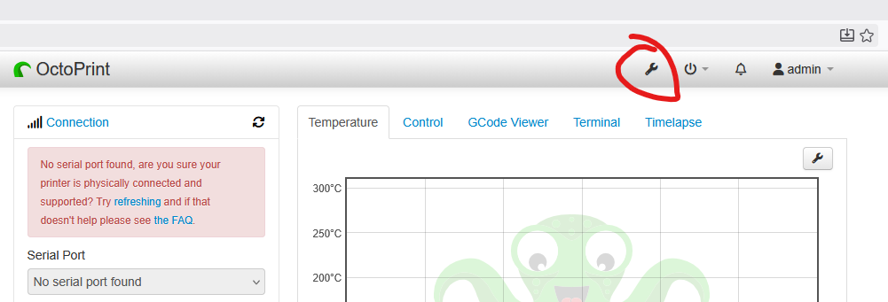

Scroll down to Virtual Printer and tick the checkbox.

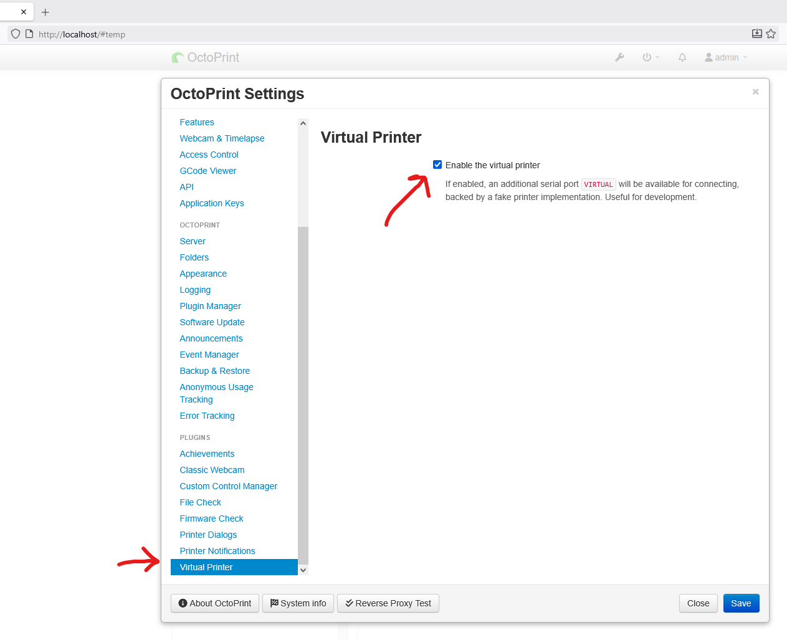

Save, then select the `VIRTUAL` serial port in the connection box, then connect to the virtual printer

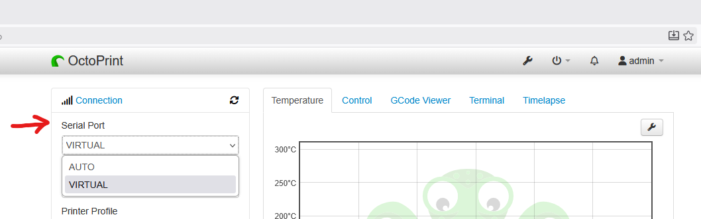

#### Enabling MQTT

Go again to settings, scroll to Plugin Manager and press +Get More.

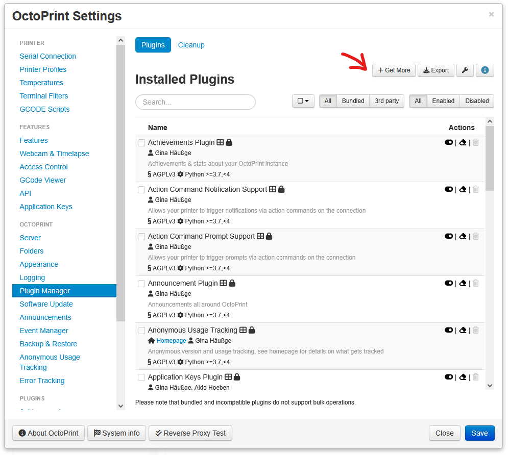

Search for MQTT, select the MQTT plugin and press install

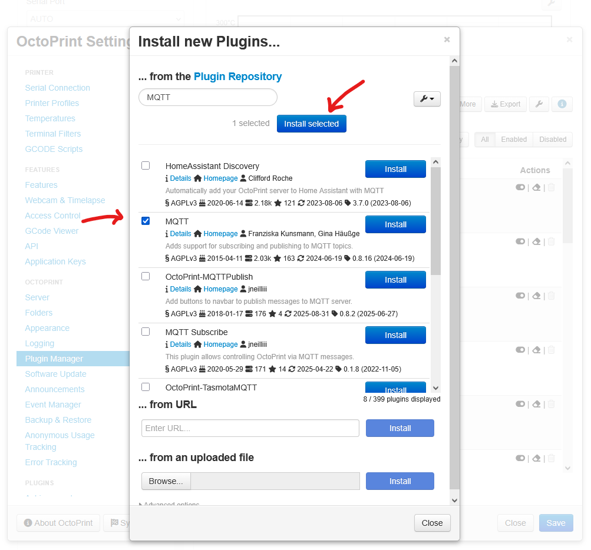

Restart Octoprint when prompted, then head into the plugin settings, and configure the Host. Hostnames resolve based on the service name in the Docker compose file, or the aliases given. In this case, both the mosquitto and the zenoh service have the alias `broker`.

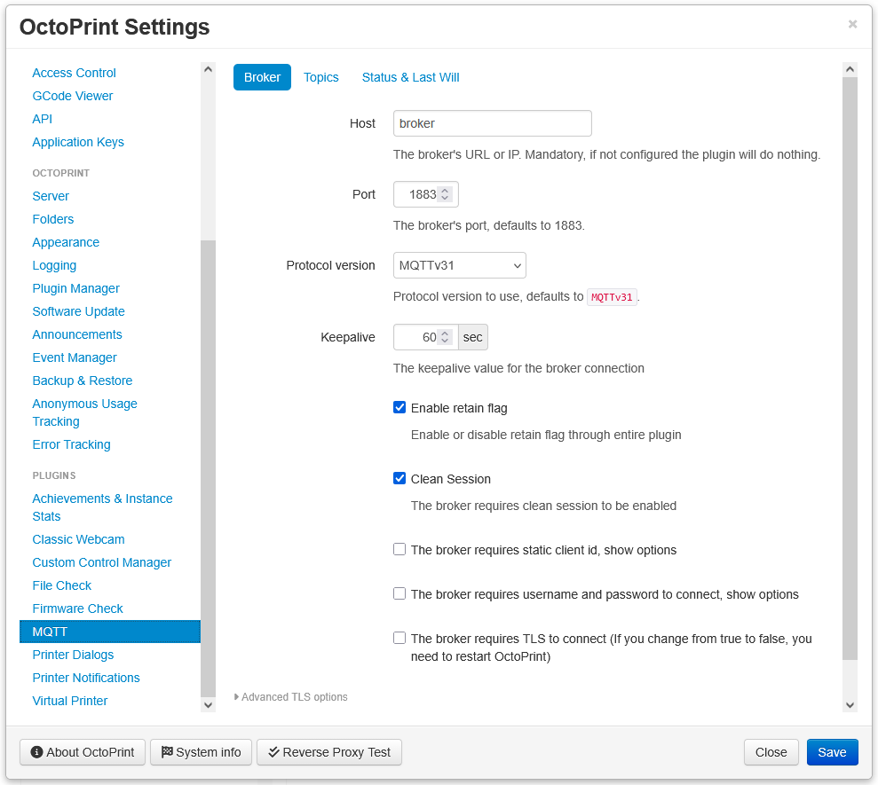

Finally, disable the Last Will message, since zenoh doesn't support it. Uncheck the two circles boxes.

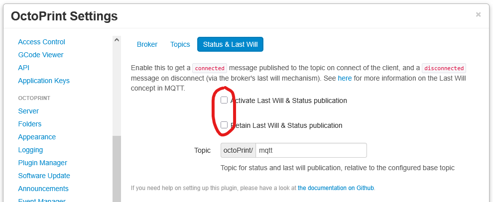

You can quickly check that the connection to the broker was set up correctly by opening a connection yourself in an MQTT program like MQTT Explorer or MQTTX, you should see the OctoPrint topic with some messages in it.

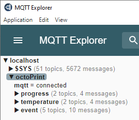

Octoprint is now ready for use.

### Setting up OctoPrint+Klipper

#### Initial setup

Follow the initial setup wizard. In the `restart octoprint command`, add `supervisorctl restart octoprint`

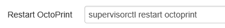

#### Adding a Virtual Printer

Go to settings, and add the additional serial port `/home/printer/printer_data/comms/klippy.serial`

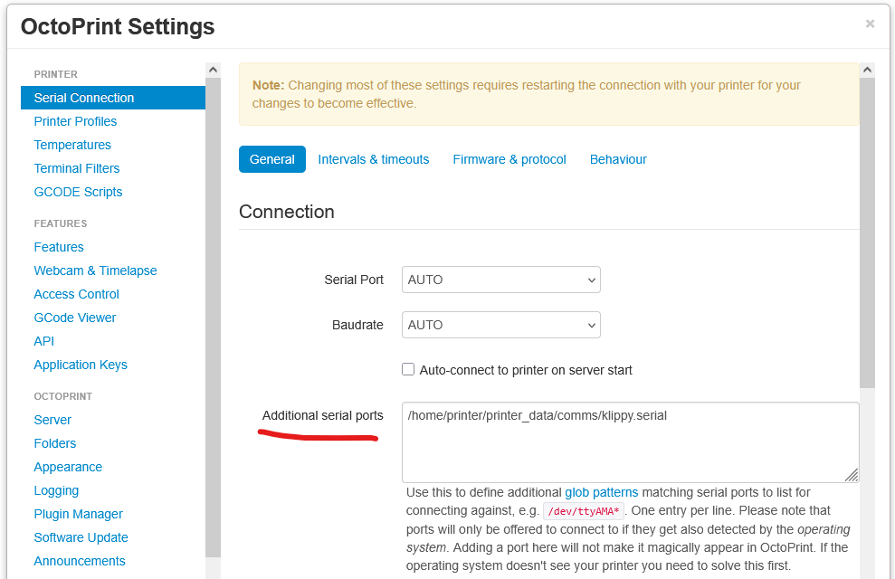

Next, head to the behaviour tab and check the second box (Cancel any ongoing...)

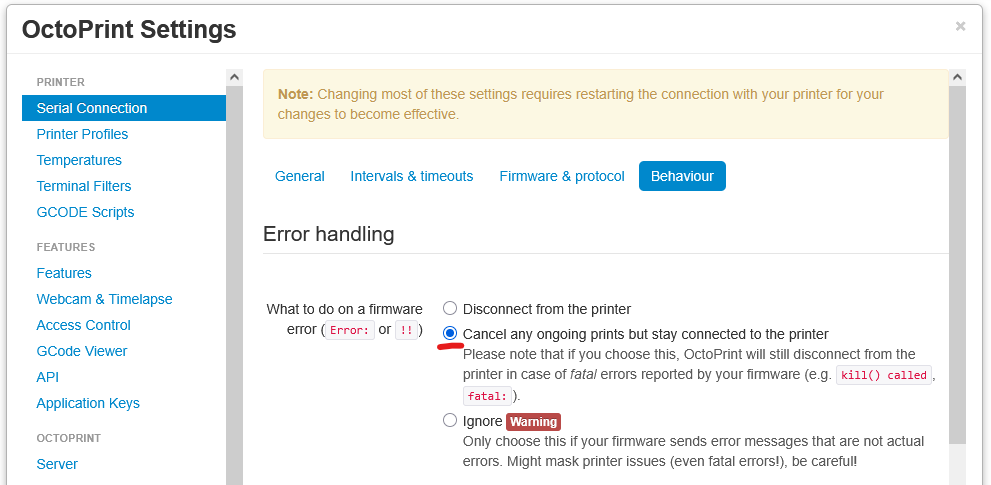

Save the settings, in the Connection box, select the klippy serial port and press connect

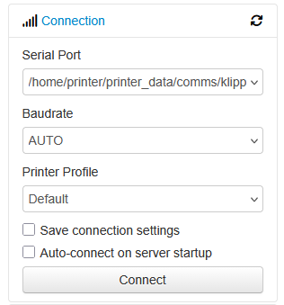

You're now connected to the simulated klipper printer.

#### Enabling MQTT

See [Setting up OctoPrint+Marlin → Enabling MQTT](#enabling-mqtt).

### Setting up Mainsail+Klipper

No setup needed, just browse to http://localhost:80 and happy (virtual) printing.

### Setting up Grafana

The topics (and hence database entries) that OctoPrint or Moonraker publish are somewhat different. We'll set up two dashboards, one for each, with their own SQL queries. We'll link to Postgresql, since that's the easiest.

#### Adding the OctoPrint Datasource

Head to `Home>Connections>Data sources` and create a new PostgreSQL datasource.

Change the following settings from the default:

* Host URL: timescaledb5432
* Database name: octoPrint
* Username: postgres
* Password: postgres
* TLS/SSL Mode: disable

Then save and test the connection.

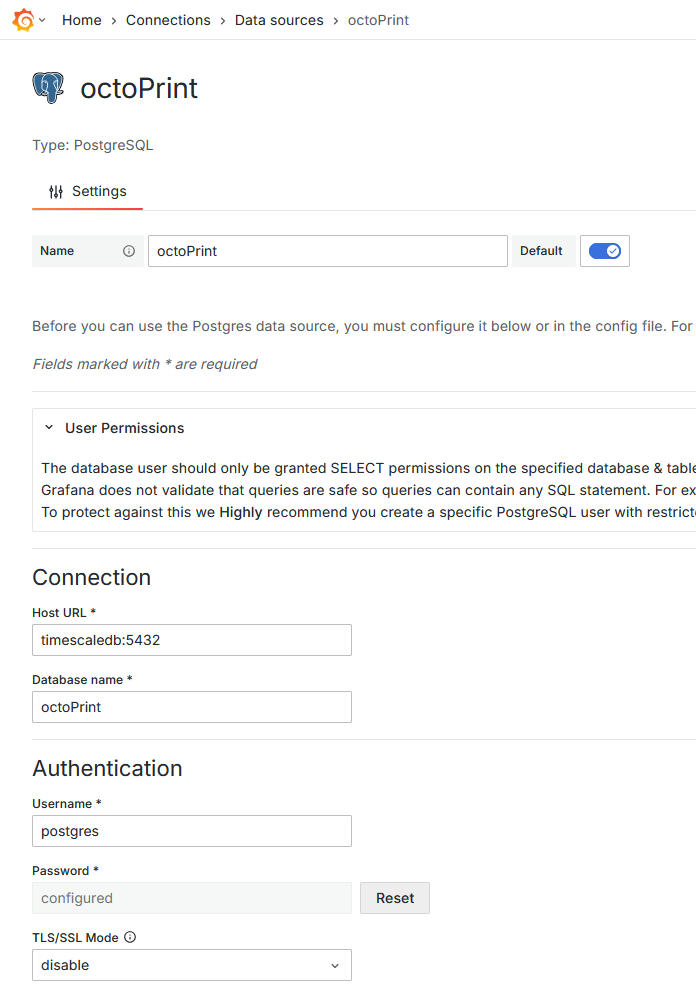

#### Creating a new OctoPrint dashboard

Head to `Home>Dashboards` and create a new dashboard, name it `octoPrint`.

#### Adding panels

Let's add some panels to the dasboard.

Open the dashboard `Home>Dashboards>octoPrint` and hit `Edit`, then `Add visualization`

Change the Visualization type to Time series (normally default), Give it an appropriate title, then select the right datasource, and add the SQL query

        select x, y, z, time from event where event='PositionUpdate';

Change the colours of x,y,z as you like, then save the dashboard.

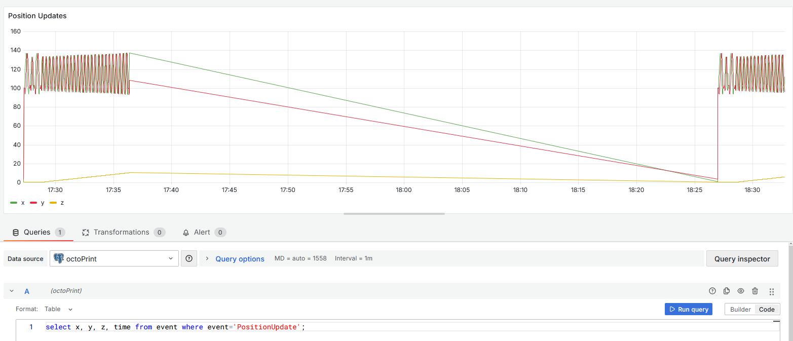

Add two more panels, use the following queries for each:

        Select actual, target, time from temperature WHERE tool='bed';

        select actual, target, time from temperature WHERE tool='tool0';

The dashboard then looks something like this (if you have data available, and once you zoom to the data.). If you don't have any data yet, start a virtual print in OctoPrint.

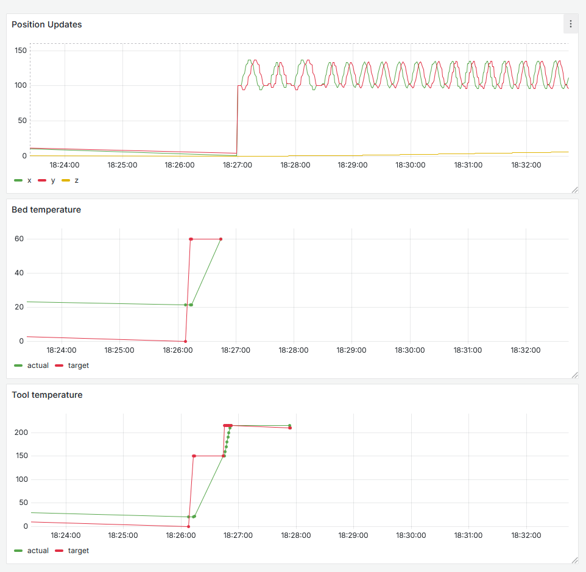

#### Adding the Klipper Datasource

Add a new datasource like you did before, but specify 'moonraker' as the database.

#### Creating a new Klipper dashboard

Head to `Home>Dashboards` and create a new dashboard, name it `Klipper`.

#### Adding panels

Do the same as before, but select the right datasource.

The queries are:

Position:

        select x, y, z, time from printer_position;

Bed temperature:

        SELECT
        time,
        last(value, time) FILTER (WHERE field = 'temperature') AS temperature,
        last(value, time) FILTER (WHERE field = 'target') AS target
        FROM printer_temperature
        WHERE $__timeFilter(time)
        AND heater = 'heater_bed'
        GROUP BY 1
        ORDER BY 1

Extruder temperature:

        SELECT
        time,
        last(value, time) FILTER (WHERE field = 'temperature') AS temperature,
        last(value, time) FILTER (WHERE field = 'target') AS target
        FROM printer_temperature
        WHERE $__timeFilter(time)
        AND heater = 'extruder'
        GROUP BY 1
        ORDER BY 1

### Slicing 3D files

See [./src/gcode/readme.md](./src/gcode/readme.md)

## notes about root user:

https://forums.docker.com/t/bind-mount-with-current-users-ownership/147176/3

Unless directories used for bind mounts already exist, docker creates them with the root user. Some containers need you to specify user: "0" to be able to write to the directories. The clean approach would be to chmod the directories after creation, but just running as root user is faster.

## Notes on the Zenoh MQTT broker:

* Doesn't support QoS 2 - doesn't break our demo luckily
* Doesn't support Last Will & Status -> in Octoprint, must disable this (two checkmarks in MQTT config), otherwise client will keep disconnecting.